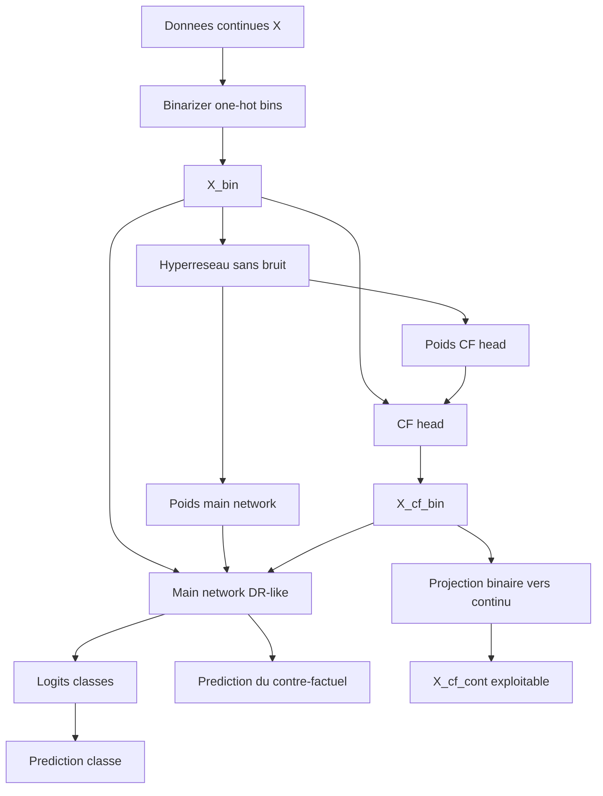

# Nouvelle architecture: DR-HyperCF binaire

Ce document décrit l'architecture du nouveau module `nouveau_module`, conçu pour:

- apprendre des règles interprétables (style DR-Net),
- générer des contre-factuels,
- fonctionner entièrement en binaire pendant l'apprentissage,
- convertir les contre-factuels en continu uniquement en sortie.

---

## 1) Idée générale

Le modèle a deux fonctions:

1. **Tête règles (main network)**: prédire la classe et fournir des règles IF-THEN.
2. **Tête contre-factuelle (CF head)**: proposer un `x_cf_bin` qui vise une classe cible.

Le point clé: la classification finale est toujours portée par la tête règles.

---

## 2) Choix de design imposés

- **Aucun bruit en entrée du hyperréseau**.
- **Entrées binarisées au début** (discrétisation + one-hot binaire).
- **Hyperréseau sans fusion alpha**: il génère 100% des poids du main network et de la tête CF.
- **Pipeline d'entraînement entièrement en binaire**.
- **Traduction binaire -> continu après génération CF** pour l'interprétation/actionabilité.

---

## 3) Flux de données

---

## 4) Composants du module

- `nouveau_module/binarizer.py`
  - `TabularBinarizer`:
    - `fit/transform` pour passer de `X_cont` a `X_bin`,
    - `binary_to_continuous` pour reconstruire une version continue d'un CF binaire.

- `nouveau_module/hypernet.py`
  - `HyperWeightGenerator`:
    - entrée = statistiques de batch `X_bin` (moyenne, ecart-type),
    - sortie = `theta_main`, `theta_cf`.

- `nouveau_module/main_rule_net.py`
  - Unpack des poids du main network DR-like,
  - calcul des logits classes,
  - extraction des règles textuelles.

- `nouveau_module/cf_head.py`
  - Unpack des poids de la tête CF,
  - génération binaire différentiable (straight-through).

- `nouveau_module/model.py`
  - orchestration globale:
    - `predict_logits(x_bin)`,
    - `generate_counterfactual_binary(x_bin, y_target)`.

- `nouveau_module/trainer.py`
  - boucle d'entraînement,
  - métriques de classification + CF,
  - export des règles.

---

## 5) Apprentissage (deux sorties, un objectif commun)

Le modèle optimise plusieurs termes:

- `L_cls`: cross-entropy sur la prédiction normale (tête règles).
- `L_cf_valid`: cross-entropy sur la prédiction du CF (`x_cf_bin`) vers la classe cible.
- `L_flip_sparse`: pénalité sur le nombre de bits modifiés entre `x_bin` et `x_cf_bin`.
- `L_rule_sparse`: régularisation de compacité des poids de règles.

Forme globale:

`L_total = L_cls + lambda_cf * L_cf_valid + lambda_flip * L_flip_sparse + lambda_rule * L_rule_sparse`

---

## 6) Quelle sortie sert a prédire?

Pour un exemple normal:

- la prédiction de classe vient de la **tête règles** (`main network`).

La tête CF ne donne pas directement une classe finale; elle génère un `x_cf_bin` qui est ensuite évalué par la tête règles.

---

## 7) Exploitation des résultats

### 7.1 Classification

- Accuracy, AUROC, matrice de confusion, rapport de classification.

### 7.2 Règles

- extraction de règles IF-THEN depuis les poids du main network générés par l'hyperréseau.

### 7.3 Contre-factuels

- `x_cf_bin` pour la cohérence logique,
- `x_cf_cont` (via projection binaire->continu) pour lecture humaine et actionabilité.

---

## 8) Différences avec la version HyConEx from scratch initiale

- Ancien module: encodeur continu + hypernetwork dynamique par échantillon + CF continu.
- Nouveau module: coeur DR-like binaire, hyperréseau sans bruit, génération complète des poids, CF binaire natif.

Ce nouveau design est plus aligné avec une lecture en règles explicites.
