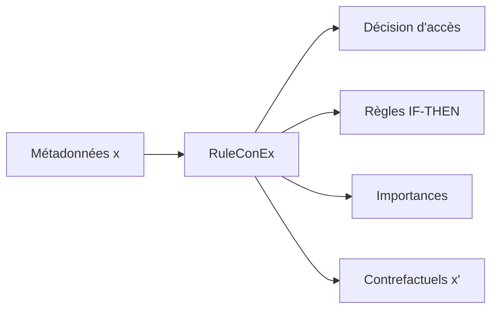
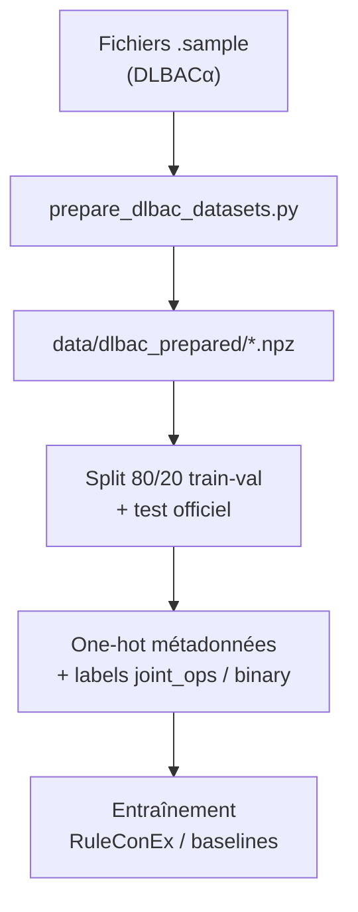

# HyConEx from scratch — Explicabilité DLBAC

Implémentation **from scratch** d'architectures d'apprentissage profond pour le **contrôle d'accès basé sur le deep learning** (DLBAC), avec explications **interprétables** : règles logiques, importances locales et contrefactuels actionnables.

Projet de recherche — mémoire de Master 2, Université de Dschang.  
**Auteur :** TSAFACK NTEUDEM ERICK

---

## Objectif

Les modèles DLBAC classiques (ex. **DLBACα**) offrent de bonnes performances mais restent des **boîtes noires**. Les approches récentes se spécialisent :

| Approche | Force | Limite |
|----------|-------|--------|
| **HyConEx** | Contrefactuels locaux en un forward pass | Pas de règles globales |
| **HyperLogic** | Règles IF-THEN diversifiées | Pas de contrefactuels |
| **DLBACα** | Référence performance | Explications post-hoc |

Ce dépôt propose **RuleConEx** (*Rule-based Counterfactual eXplainer*), qui **unifie** ces capacités, ainsi qu'un écosystème de prototypes, baselines et benchmarks pour l'évaluation comparative.

---

## Contribution principale : RuleConEx

**RuleConEx** (`ruleconex/`) combine en **une seule passe avant** :

- classification multi-branches (HyConEx + HyperLogic + TabResNet),
- règles IF-THEN décodables (`oh_* → ops_pattern_*`),
- importances locales par requête,
- contrefactuels vers les classes alternatives (mécanismes **sub** + **flip**).



**Documentation détaillée :** [`ruleconex/README.md`](ruleconex/README.md)

```bash
# Entraînement rapide (GPU CUDA requis)
python -m ruleconex.main --dataset u4k-r4k-auth11k --explain

# Démonstration interactive
jupyter notebook ruleconex/RuleConEx_Demo.ipynb
```

---

## Organisation du dépôt

```
HyConEx_from_scratch/
├── ruleconex/              ★ Modèle unifié RuleConEx (contribution principale)
├── nouveau_module/         Socle HyConEx + HyperLogic (hyperréseau TabResNet, DR-Net, CF)
├── mega_benchmark/         Benchmark multi-jeux / multi-modèles
├── hyconex_from_scratch/   Prototype HyConEx original (encodeur + hyperréseau + CF)
├── hyconex_hyperlogic/     Hybride HyConEx + HyperLogic (2 phases)
├── hyperlogic_pure/        PureDRNet — règles seules (HyperLogic)
├── hyconex_pure_local/     HyConEx local (contrefactuels seuls)
├── hyconex_pure_rules/     Règles pures décodées
├── hyconex_pure_bipolar/   Variante encodage bipolaire
├── tabresnet_dlbac/        TabResNet + instance-wise (baseline DLBAC)
├── dlbac_alpha_baseline/   Reproduction DLBACα (ResNet)
├── dr_cf_teacher/          Enseignant CF pour distillation
├── data/dlbac_prepared/    Jeux DLBAC préparés (.npz, manifestes)
├── notebooks/              Notebooks d'analyse et comparaisons
├── docs/                   Schémas d'architecture (.dot, .md)
├── redaction/              Rapport de mémoire, résultats LaTeX
├── prepare_dlbac_datasets.py
├── run_with_hyconex.ps1    Lanceur Windows (conda hyconex)
└── train_*.py              Scripts d'entraînement par module
```

---

## Modules et variantes

| Module | Rôle | Script typique |
|--------|------|----------------|
| **`ruleconex`** | Modèle unifié règles + CF + classification | `python -m ruleconex.main` |
| **`nouveau_module`** | HybridDRNet (HyConEx + DR-Net) | `train_nouveau_module_dlbac_quantile.py` |
| **`hyconex_hyperlogic`** | Fusion pondérée linéaire + règles | `train_hyconex_hyperlogic_dlbac.py` |
| **`hyconex_from_scratch`** | HyConEx minimal (Iris, WDBC, DLBAC) | `train_hyconex_from_scratch_dlbac.py` |
| **`hyperlogic_pure`** | DR-Net / règles Monte Carlo | `train_pure_drnet_dlbac.py` |
| **`hyconex_pure_local`** | Contrefactuels HyConEx seuls | `train_hyconex_pure_local_dlbac.py` |
| **`tabresnet_dlbac`** | TabResNet instance-wise | `train_tabresnet_dlbac.py` |
| **`dlbac_alpha_baseline`** | DLBACα (papier Karimi et al.) | `train_dlbac_alpha_all_datasets.py` |
| **`mega_benchmark`** | Comparaison systématique | `python -m mega_benchmark` |

---

## Prérequis

### Matériel & logiciel

- **Python** ≥ 3.10
- **PyTorch** avec **CUDA** (obligatoire pour les modèles neuronaux du projet)
- **NumPy**, **scikit-learn**, **matplotlib**, **pandas** (notebooks)
- **Jupyter** (démonstrations interactives)

### Environnement Conda recommandé

```bash
conda create -n hyconex python=3.11 pytorch pytorch-cuda=12.1 -c pytorch -c nvidia
conda activate hyconex
pip install numpy scikit-learn matplotlib pandas jupyter
```

Sous Windows, le script `run_with_hyconex.ps1` pointe vers `C:\anaconda\envs\hyconex\python.exe`.

### Données DLBAC brutes

Les jeux synthétiques et Amazon proviennent du dépôt **DLBACα** (à placer au voisinage du projet) :

```
projet/
├── DlbacAlpha-main/dataset/   # sources .sample
└── HyConEx_from_scratch/      # ce dépôt
```

---

## Préparation des données

Pipeline unifié : suppression `uid`/`rid`, masquage des métadonnées, one-hot, split train/val/test, export `.npz`.

```bash
cd HyConEx_from_scratch
python prepare_dlbac_datasets.py --all
python prepare_dlbac_datasets.py --dataset u4k-r4k-auth11k amazon1
```

**Sortie :** `data/dlbac_prepared/` (`*.npz`, `*.json`, `manifest.json`, cache one-hot Amazon).

| Type | Jeux | Classes |
|------|------|---------|
| Synthétiques | `u4k-r4k-auth11k`, `u5k-r5k-auth12k`, `u6k-r6k-auth32k`, … | 16 profils `ops_pattern_*` |
| Amazon (réels) | `amazon1`, `amazon2`, `amazon3` | 2 (deny / grant) |

---

## Démarrage rapide

### 1. RuleConEx (recommandé)

```bash
conda activate hyconex
cd HyConEx_from_scratch

python prepare_dlbac_datasets.py --dataset u4k-r4k-auth11k
python -m ruleconex.main --dataset u4k-r4k-auth11k --epochs 30 --explain
python ruleconex/test_ruleconex.py --dataset u4k-r4k-auth11k --epochs 5
```

### 2. Méga-benchmark comparatif

Compare RuleConEx à MLP, RF, SVM, HyConEx-Local, HyperLogic, HyConEx+HyperLogic, DLBACα, TabResNet sur les 11 jeux DLBAC.

```bash
python -m mega_benchmark
python -m mega_benchmark --focus u4k-r4k-auth11k --models ruleconex,mlp,rf
python -m mega_benchmark --skip-amazon --retrain
```

**Résultats :** `results/mega_comparison/`  
**Notebook :** `notebooks/mega_comparison_all_datasets.ipynb`

### 3. Hybride HyConEx + HyperLogic

```bash
python train_hyconex_hyperlogic_dlbac.py --dataset u4k-r4k-auth11k --save
python train_hyconex_hyperlogic_dlbac.py --dataset amazon1
```

### 4. Prototype HyConEx original (tabulaire général)

```bash
python train_iris.py                                    # smoke test
python train_hyconex_from_scratch_dlbac.py --epochs 20  # DLBAC
jupyter notebook notebooks/hyconex_from_scratch_iris_counterfactuals.ipynb
```

### 5. Nouveau module (quantiles / Amazon)

```bash
python train_nouveau_module_dlbac_quantile.py --dataset u4k-r4k-auth11k
python train_nouveau_module_dlbac_amazon_quantile.py --dataset amazon1
```

### Lanceur Windows

```powershell
.\run_with_hyconex.ps1 -m ruleconex.main --dataset u4k-r4k-auth11k
.\run_with_hyconex.ps1 train_hyconex_hyperlogic_dlbac.py --dataset amazon1 --save
```

---

## Notebooks principaux

| Notebook | Contenu |
|----------|---------|
| `ruleconex/RuleConEx_Demo.ipynb` | Démo complète RuleConEx (métriques, courbes, règles, CF) |
| `notebooks/mega_comparison_all_datasets.ipynb` | Benchmark multi-modèles |
| `notebooks/nouveau_module_dlbac_all_datasets.ipynb` | HybridDRNet sur tous les jeux |
| `notebooks/tabresnet_dlbac_all_datasets.ipynb` | TabResNet DLBAC |
| `notebooks/amazon_classical_baselines.ipynb` | Baselines sklearn (Amazon) |
| `notebooks/hyconex_pure_local_dlbac_all.ipynb` | HyConEx-Local seul |

---

## Pipeline de données (résumé)



Étapes détaillées : masquage au-delà de 8 attributs user/resource, encodage one-hot ajusté sur le train, bipolarisation optionnelle, graine 42.

---

## Métriques d'évaluation

### Classification

- Accuracy, F1 macro, précision, rappel
- AUC (jeux binaires Amazon)
- Balanced accuracy, deny F1 (seuil grant/deny tuné)

### Explicabilité RuleConEx

- **Validité CF** : part des contrefactuels classés dans la classe cible
- **Proximité L1** : distance moyenne `‖x' − x‖₁`
- **Features modifiées** : nombre moyen de flips one-hot
- **Règles** : score des neurones-règles, littéraux `oh_*` actifs

---

## Résultats et rédaction

- `redaction/rapport_avancement.tex` — rapport d'avancement (méthodologie, architecture)
- `redaction/resultats_ruleconex_mega_benchmark.tex` — tableaux comparatifs RuleConEx vs état de l'art
- `results/mega_comparison/` — exports JSON du méga-benchmark
- `outputs/ruleconex/` — résultats CLI RuleConEx

---

## Architecture RuleConEx (aperçu)

Un **hyperréseau TabResNet** génère, pour chaque requête d'accès, les paramètres θ de trois branches :

1. **HyConEx** — classifieur linéaire local + importances → contrefactuels par soustraction
2. **HyperLogic** — DR-Net à règles IF-THEN, échantillonnage Monte Carlo (M train / M' inférence)
3. **Deep** (optionnel) — TabResNet léger sur l'entrée ou le latent

Fusion softmax des branches → prédiction finale.  
Contrefactuel : `x' = 0.55·x_sub + 0.45·x_flip` (jeux `d ≤ 512`) ou soustraction seule (Amazon haute dimension).

Voir [`ruleconex/README.md`](ruleconex/README.md) et `docs/nouveau_module_architecture*.dot`.

---

## Scripts utilitaires

| Script | Usage |
|--------|-------|
| `show_hyconex_explanations.py` | Afficher explications HyConEx |
| `show_hyconex_pure_rules_decoded.py` | Décoder règles IF-THEN |
| `show_pure_drnet_explanations.py` | Explications PureDRNet |
| `eval_cf_harmonized_dlbac.py` | Métriques CF harmonisées entre modèles |
| `feature_engineering_amazon.py` | Feature engineering Amazon |

---

## Références

- Karimi et al., *Deep Learning Based Access Control*, 2022 — **DLBAC / DLBACα**
- Marszalek et al., *Hypernetwork Classifier with Counterfactual Explanations* — **HyConEx**
- *Enhancing Diversity and Accuracy in Rule Learning with HyperNets* — **HyperLogic**

---

## Structure des dépendances internes

```
ruleconex
  └── nouveau_module (hypernet, cf_head, main_rule_net)
        └── hyconex_from_scratch (utilitaires, bipolarisation)

mega_benchmark
  └── ruleconex, hyconex_pure_local, hyperlogic_pure, hyconex_hyperlogic,
      tabresnet_dlbac, dlbac_alpha_baseline, sklearn baselines
```

---

## Licence

Projet de recherche académique. Les données DLBAC sont soumises aux conditions du dépôt [DLBACα](https://github.com/). Vérifier les licences des jeux Amazon et des sources associées avant redistribution.

---

## Citation suggérée

```bibtex
@mastersthesis{tsafack2026ruleconex,
  author  = {TSAFACK NTEUDEM ERICK},
  title   = {Explicabilité du contrôle d'accès basé sur le deep learning :
             architecture RuleConEx unifiant règles et contrefactuels},
  school  = {Université de Dschang},
  year    = {2026}
}
```
