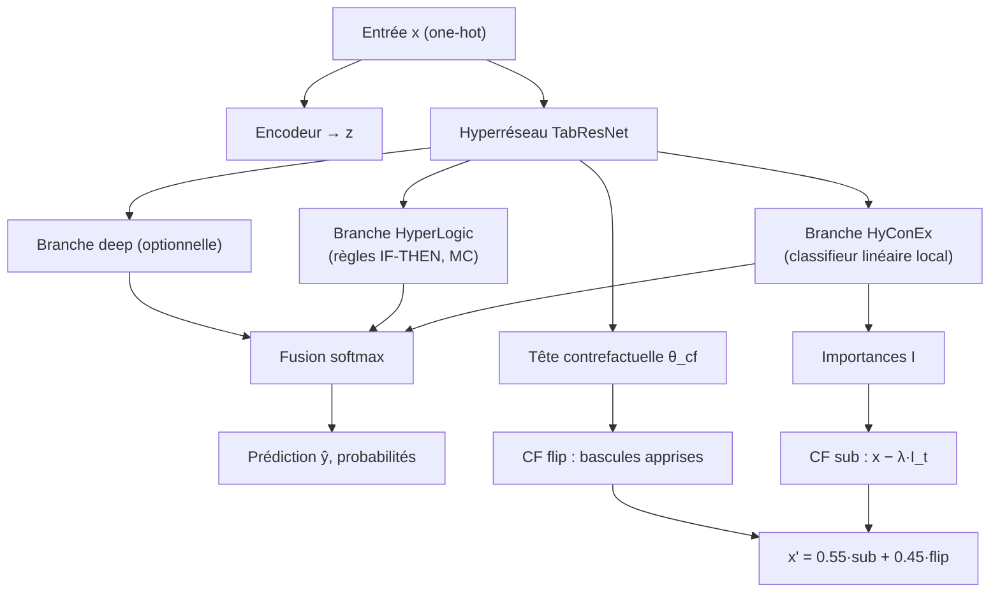

# RuleConEx

**Rule-based Counterfactual eXplainer** — modèle unifié pour le contrôle d'accès basé sur l'apprentissage profond (DLBAC).

RuleConEx combine en **un seul forward pass** :
- une **classification** performante (grant/deny ou profils d'opérations),
- des **règles IF-THEN** locales décodables (inspiré de [HyperLogic](https://arxiv.org/abs/2402.00000)),
- des **contrefactuels actionnables** (inspiré de [HyConEx](https://arxiv.org/abs/2601.00000)).

Conçu pour les jeux de données **DLBAC** (synthétiques + Amazon), avec métadonnées encodées en one-hot.

---

## Fonctionnalités

| Capacité | Description |
|----------|-------------|
| **Classification** | Fusion de 3 branches : HyConEx (linéaire local), HyperLogic (règles), TabResNet (deep optionnel) |
| **Règles IF-THEN** | Extraction de règles `oh_* → ops_pattern_*` avec scores de confiance |
| **Importances locales** | Métadonnées dominantes par classe, par requête |
| **Contrefactuels** | Profils alternatifs minimaux pour changer la décision d'accès |
| **Monte Carlo** | M échantillons de règles à l'entraînement, M' à l'inférence (diversité HyperLogic) |

---

## Architecture



### Contrefactuels : deux candidats complémentaires

| Mécanisme | Idée | Intérêt |
|-----------|------|---------|
| **sub** | `x_sub = clip(x − 0.35·I_{t,:}, 0, 1)` | Proximité, lien avec les importances HyConEx |
| **flip** | MLP conditionné par `[x ; onehot(t)]` → bascules ±1 | Flips discrets actionnables sur les métadonnées |

> Sur les jeux à **haute dimension** (Amazon, `d > 512`), seul le mécanisme **sub** est utilisé ; les règles et l'hyperréseau opèrent dans l'espace latent `z`.

---

## Structure du module

```
ruleconex/
├── README.md              # Ce fichier
├── config.py              # RuleConExConfig (hyperparamètres)
├── model.py               # RuleConExModel, hyperréseau, génération CF
├── trainer.py             # RuleConExTrainer (entraînement GPU)
├── loss.py                # Perte composite (CE + CF + régularisations)
├── evaluate.py            # Métriques classification + validité CF
├── utils.py               # explain_sample, extraction de règles, rapports CF
├── visualize.py           # Courbes, heatmaps, comparaisons
├── main.py                # CLI d'entraînement
├── test_ruleconex.py      # Tests rapides
└── RuleConEx_Demo.ipynb   # Démonstration interactive
```

**Dépendances internes** (dépôt parent `HyConEx_from_scratch`) :
- `nouveau_module/` — hyperréseau TabResNet, tête CF, DR-Net
- `prepare_dlbac_datasets.py` — jeux DLBAC préparés
- `train_nouveau_module_dlbac_quantile.py` — chargement des splits one-hot

---

## Prérequis

- **Python** ≥ 3.10
- **PyTorch** avec **CUDA** (GPU obligatoire pour l'entraînement)
- **NumPy**, **scikit-learn**, **matplotlib**

Environnement Conda recommandé :

```bash
conda create -n hyconex python=3.11 pytorch pytorch-cuda=12.1 -c pytorch -c nvidia
conda activate hyconex
pip install numpy scikit-learn matplotlib
```

Les jeux DLBAC doivent être préparés au préalable :

```bash
cd HyConEx_from_scratch
python prepare_dlbac_datasets.py --all
```

Les fichiers `.npz` / `.json` sont écrits dans `data/dlbac_prepared/`.

---

## Démarrage rapide

### Ligne de commande

Depuis la racine `HyConEx_from_scratch/` :

```bash
python -m ruleconex.main --dataset u4k-r4k-auth11k
python -m ruleconex.main --dataset amazon1 --epochs 30 --explain
python -m ruleconex.main --dataset u4k-r4k-auth11k --no-baselines --out-dir outputs/ruleconex/run1
```

Sous Windows (environnement Conda `hyconex`) :

```powershell
.\run_with_hyconex.ps1 -m ruleconex.main --dataset u4k-r4k-auth11k
```

### API Python

```python
from prepare_dlbac_datasets import discover_dlbac_datasets
from train_nouveau_module_dlbac_quantile import build_onehot_splits
from ruleconex import RuleConExConfig, RuleConExTrainer, explain_sample

specs = {s.name: s for s in discover_dlbac_datasets()}
splits = build_onehot_splits(specs["u4k-r4k-auth11k"], random_state=42)

cfg = RuleConExConfig(epochs=30, batch_size=128, num_rules=48)
trainer = RuleConExTrainer(cfg, device="cuda")
result = trainer.fit(
    splits.x_train, splits.y_train,
    splits.x_val, splits.y_val,
    feature_names=splits.feature_names,
    class_names=splits.class_names,
)

# Explication complète (prédiction + règles + contrefactuels)
report = explain_sample(
    trainer.model,
    splits.x_test[0],
    None,
    feature_names=splits.feature_names,
    class_names=splits.class_names,
    device=trainer.device,
)
print(report.text_report)
```

### Notebook de démonstration

Ouvrir `ruleconex/RuleConEx_Demo.ipynb` : chargement des données, entraînement, métriques, courbes, règles et contrefactuels.

### Tests

```bash
python ruleconex/test_ruleconex.py
python ruleconex/test_ruleconex.py --dataset u4k-r4k-auth11k --epochs 5
```

---

## Jeux de données supportés

| Type | Exemples | Classes | Remarques |
|------|----------|---------|-----------|
| Synthétiques DLBAC | `u4k-r4k-auth11k`, `u5k-r5k-auth12k`, … | 16 (`ops_pattern_*`) | sub + flip, règles sur entrée |
| Amazon (réels) | `amazon1`, `amazon2`, `amazon3` | 2 (deny / grant) | sub seul, auto-tune mémoire GPU |

Découverte automatique via `discover_dlbac_datasets()` dans `data/dlbac_prepared/`.

---

## Configuration

Hyperparamètres par défaut (`RuleConExConfig`) :

| Paramètre | Défaut | Rôle |
|-----------|--------|------|
| `epochs` | 40 | Nombre d'époques |
| `batch_size` | 128 | Taille de lot (réduit auto. si `d > 512`) |
| `lr` | 1e-3 | Taux d'apprentissage (AdamW) |
| `num_rules` | 48 | Nombre de neurones-règles HyperLogic |
| `mc_train_samples` | 3 | Échantillons Monte Carlo (train) |
| `mc_infer_samples` | 5 | Échantillons Monte Carlo (inférence) |
| `cf_lambda` | 0.12 | Poids perte contrefactuelle |
| `conex_lambda` | 0.08 | Proximité L1 des CF |
| `flip_lambda` | 0.04 | Proximité L2 des CF |

Le checkpoint retenu est celui qui maximise l'**accuracy de validation** sur l'ensemble des époques.

---

## Sorties et explicabilité

En inférence, `explain_sample()` produit :

1. **Prédiction** et probabilités par classe
2. **Top importances** locales (`oh_*`)
3. **Règles IF-THEN** décodées (`extract_rules_from_pack`)
4. **Contrefactuels** vers les classes alternatives les plus probables (`counterfactual_report`)

Métriques d'évaluation (`evaluate_ruleconex`) :

- Classification : accuracy, F1 macro, précision, rappel, AUC (binaire)
- Contrefactuels : `validity_cf`, `changed_features_mean`, `proximity_l1_mean`, `flip_success_rate`

---

## Références

- **DLBAC** — Karimi et al., *Deep Learning Based Access Control*, 2022
- **HyConEx** — Marszalek et al., *Hypernetwork Classifier with Counterfactual Explanations*, 2026
- **HyperLogic** — *Enhancing Diversity and Accuracy in Rule Learning with HyperNets*, 2024

---

## Auteur

**TSAFACK NTEUDEM ERICK** — Mémoire de Master 2, Université de Dschang  
Projet de recherche sur l'explicabilité du contrôle d'accès basé sur le deep learning.

---

## Licence

Ce module fait partie du dépôt de recherche `HyConEx_from_scratch`. Voir la licence du dépôt parent pour les conditions d'utilisation et de redistribution.
